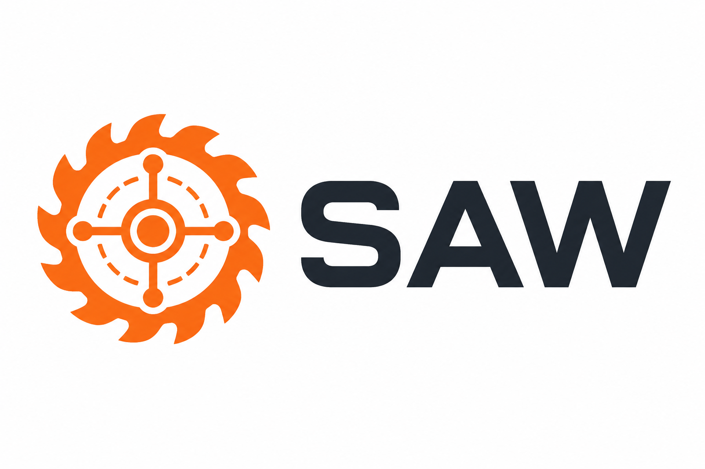

# {{PROJECT_NAME}}

<p align="center">
  
</p>

Created with [`create-saw-app`](https://github.com/) — **Saw**: measure twice, cut
once, for AI-written code. This repo ships with a quality-gated AI development
workflow preconfigured: role agents with enforced permissions, spec/QA/security
gates, and an optional Vibe Kanban board.

## Quick start

```bash
npm install       # installs Vibe Kanban locally
npm run board     # kanban board; first run: pick OPENCODE as executor
```

Or straight from the terminal, no board:

```bash
opencode
# then create the spec for your first task (bootstrap your stack):
# /spec Project skeleton: <your stack>. Criteria: build and lint pass. Out of scope: features.
```

## The 30-second version

1. `/spec <description>` — an analyst agent writes a spec with testable acceptance
   criteria into `.workflow/specs/`.
2. **You read and approve the spec** — this is your main job.
3. `/run-task TASK-001` — agents run the whole pipeline: implement → independent QA
   (up to 3 rounds) → security → evidence pack. No merge.
4. You review (diff, app, QA report) → merge → `/close-task TASK-001`.

On the board, use cards with `/run-task-vk TASK-NNN` instead — Vibe Kanban owns the
worktrees and PRs. Lost? `/check-workflow` always knows the next step.

## After install

- [ ] Put your real test/lint commands into `.workflow/templates/spec-template.md`
      (replace the `<command>` placeholders) — right after your first scaffolding task.
- [ ] Assign models per role (strong for specs, cheap for typing) — [docs/models.md](docs/models.md).
- [ ] Skim the contract every agent obeys — [AGENTS.md](AGENTS.md).

## Documentation

| Doc | What's inside |
|---|---|
| [docs/getting-started.md](docs/getting-started.md) | First task end-to-end |
| [docs/concepts.md](docs/concepts.md) | Gates, roles, artifacts, the evidence principle |
| [docs/commands.md](docs/commands.md) | All 14 commands reference |
| [docs/models.md](docs/models.md) | Which model per role and why |
| [docs/vibe-kanban.md](docs/vibe-kanban.md) | Board setup and parallel execution |
| [docs/faq.md](docs/faq.md) | Honest answers |

Документация на русском: [docs/ru/](docs/ru/)
